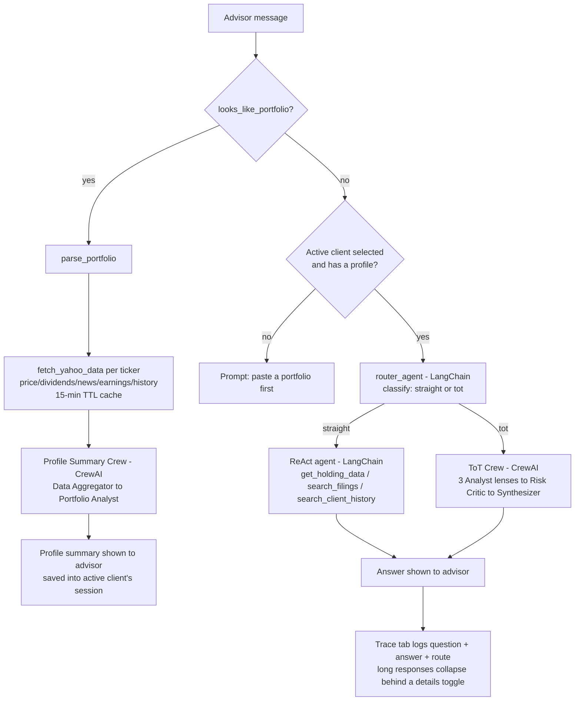

# Portfolio Advisor

A Gradio chat app for financial advisors: paste a client's portfolio, get an
AI-generated profile summary, then ask follow-up questions. Under the hood it
routes each question to either a quick fact-lookup agent or a multi-agent
deliberation crew, and keeps a separate memory per client so an advisor can
manage several client sessions at once.

## Problem

A financial advisor managing several clients needs fast, specific answers
about each portfolio — "what's this holding's dividend yield," "why did it
move," "should we rebalance given this concentration" — without either (a)
manually digging through market data and filings per client, or (b) trusting
an LLM's answer at face value, since an ungrounded or advice-framed response
from a tool with no licensed advisor behind it is a real liability. This
project targets both halves: routing simple lookups and complex judgment
calls to the pipeline suited for each, and wrapping every generated answer in
guardrails and evaluators (data-access limits, a read-only audit at startup,
advice-language flagging, faithfulness/relevancy scoring, and a visible
confidence flag) so the advisor — not the model — makes the final call. See
the "Guardrails & evaluators" section below for the full design.

## Application flow



Live progress (via `gr.Progress`) narrates each stage as it runs — e.g.
"Step 3/4: Running ToT strategy analysis (3 analysts + critic + synthesis,
~30-60s)..." — so the advisor sees which loop is running, not just a bare
spinner. The chat input itself is disabled with a prompt to select/create
a client until one is active — a message can't be sent without one, not
just rejected after the fact.

Two independent agent stacks are used side by side:

- **CrewAI** (`Agent`/`Task`/`Crew`) for multi-step, multi-perspective work:
  building the profile summary, and the Tree-of-Thought (ToT) deliberation
  for strategy questions.
- **LangChain** (`ChatAnthropic`, `create_agent`) for lighter single-shot
  work: classifying a question, and the ReAct tool-calling loop for
  fact lookups.

Every session is scoped to a **client**: the advisor creates or selects a
client from the Clients tab, and that client's portfolio, chat history, and
trace log are stored independently in memory (see [Clients & sessions
model](#clients--sessions-model)).

## Folder & code hierarchy

```
main.py                          Entry point: FastAPI app (Google sign-in
│                                  routes + Gradio mounted at /app), uvicorn
market_forecaster/
├── config.py                    Env loading (.env), required-secret checks
│                                 (API key, SEC user agent, Google OAuth
│                                 credentials, session secret), LLM client
│                                 factories for LangChain (get_chat_model) and
│                                 CrewAI (get_crew_llm)
├── auth.py                      Google OAuth: login/callback/logout routes,
│                                 the / landing page, and get_current_advisor
│                                 (the auth_dependency gr.mount_gradio_app uses)
│
├── data/                        Everything that touches raw external data
│   ├── parser.py                Portfolio text -> holdings (CSV, ticker+shares
│   │                             pairs, or a bare ticker list); the cheap
│   │                             "is this a portfolio?" heuristic
│   ├── market_data.py           yfinance fetching: price, dividends, valuation,
│   │                             analyst rating, recent news, 3-month price
│   │                             trend, earnings — plus the CrewAI tool wrapper
│   │                             used by the Profile Summary Crew's aggregator
│   ├── alpha_vantage.py         Secondary source, cross-checks Yahoo's
│   │                             earnings/news sentiment per ticker — never
│   │                             blocks, degrades silently without a key
│   │                             or under the free tier's rate limit
│   ├── cache.py                 Generic in-memory TTLCache (15-min TTL),
│   │                             keyed per ticker to avoid re-fetching
│   ├── vector_store.py          Thin ChromaDB wrapper — append-only by
│   │                             construction (deterministic ids, upsert,
│   │                             has_chunks existence checks before any
│   │                             fetch/embed work)
│   └── sec_filings.py           SEC EDGAR fetching (ticker -> CIK -> latest
│                                 10-K) + word-count chunking
│
├── agents/                      One file per pipeline/agent
│   ├── profile_crew.py          CrewAI: Data Aggregator -> Portfolio Analyst
│   ├── router.py                LangChain: classifies a question as
│   │                             "straight" or "tot" — defaults *toward*
│   │                             tot on an ambiguous label, so open-ended/
│   │                             causal questions get deliberation rather
│   │                             than silently falling to the cheap path
│   ├── react_agent.py           LangChain: tool-calling ReAct agent —
│   │                             get_holding_data (market data),
│   │                             search_filings (semantic search over a
│   │                             ticker's 10-K), search_client_history
│   │                             (semantic search over this client's past
│   │                             conversation, scoped by client_id)
│   ├── tot_crew.py              CrewAI: 3 Analyst-lens generators -> Risk
│   │                             Critic -> Synthesizer
│   └── utils.py                 extract_text() — normalizes LangChain
│                                 message .content (str or list-of-blocks)
│
├── core/                        Business logic that ties data + agents together
│   ├── orchestrator.py          respond() — the single place that decides
│   │                             portfolio-submission vs. follow-up, and
│   │                             which agent pipeline handles a follow-up
│   ├── clients.py                Per-client session shape + id/choice helpers
│   ├── client_store.py           SQLite persistence, partitioned per advisor
│   │                              (composite (advisor_id, id) primary key) —
│   │                              long-term memory across app restarts
│   ├── alerts.py                  Portfolio rollup: diffs a fresh fetch
│   │                              against a client's prior snapshot for
│   │                              rating/price changes
│   └── trace.py                  Formats the Trace tab's HTML from a
│                                  session's Q&A log
│
└── ui/                          Gradio wiring — the only layer that imports gradio
    ├── app.py                    Blocks layout: chat + Clients tab + Trace tab,
    │                              chat_fn, and client create/switch/delete
    └── styles.py                  CSS and static header HTML
```

**Dependency direction**: `ui` → `core` → `agents` → `data` → `config`. Lower
layers never import from higher ones — `data/` doesn't know CrewAI/LangChain
exist beyond the one tool wrapper, and `agents/` don't know Gradio exists.

## Authentication: Google sign-in

Every advisor signs in with Google before reaching the app at all — see
`market_forecaster/auth.py`. The Gradio app itself is mounted at `/app`
(not `/`); `/` is a plain FastAPI landing page that redirects into `/app`
if already signed in, or shows a "Sign in with Google" link otherwise. This
sidesteps relying on Gradio's own (undocumented, for a custom
`auth_dependency`) unauthenticated-page behavior — the landing page is
ours, fully controllable and testable. `gr.mount_gradio_app`'s
`auth_dependency` parameter is the mechanism: it reads the Google `sub`
(stable unique user id) out of the signed session cookie, and whatever it
returns becomes `request.username` inside every Gradio event handler that
declares a `request: gr.Request` parameter — that's how `create_client`,
`delete_client`, `chat_fn`, and the client-list refresh all know which
advisor they're acting for.

Every row in `clients.db` is partitioned by that `sub` via a **composite
primary key** `(advisor_id, id)`, not `id` alone — `id` is a locally
generated 8-hex-character string with no cross-advisor uniqueness
guarantee, so keying on the pair means a delete or update scoped to the
wrong advisor matches zero rows at the SQL level, not just "filtered out"
in Python. The `client_history` ChromaDB collection (which has no advisor
concept of its own) gets the same treatment via an `advisor_id:client_id`
compound key in its ids/metadata, so `search_client_history` can never
surface a different advisor's conversation even on a client-id collision.

## Clients & sessions model

`clients_state` (a single `gr.State` dict) is the in-memory source of truth
during a session: `{client_id: {"name", "profile", "trace", "chat"}}`,
scoped to whichever advisor is signed in (see Authentication above). The
Clients tab lets an advisor create a new client (name must be unique
*within their own clients*, case-insensitive — checked via
`core/clients.py::name_exists`), search clients by name (live-filtered,
case-insensitive substring match), switch between existing ones (loads that
client's chat/profile/trace into view), or delete one.

**Persistence**: every create, chat turn (including a portfolio update —
re-pasting a portfolio for an existing client *replaces* their holdings
entirely, not merges), and delete is mirrored to `clients.db` (SQLite, via
`core/client_store.py`) at the project root. Each new browser session
re-reads that advisor's clients fresh from disk on load (`demo.load` →
`refresh_clients_on_load`) rather than trusting a stale in-memory snapshot,
so an advisor can close the app and pick up exactly where they left off on
any device, signing back in with the same Google account. The 15-minute
ticker cache is *not* persisted — only client sessions are.

## Portfolio rollup alerts

Re-pasting an existing client's portfolio (a "check-in") diffs the newly
fetched market data against that client's *own previously-persisted*
snapshot (`profile_state["raw_data"]` from before this turn overwrites
it — see `core/alerts.py`). Two kinds of per-ticker change are flagged:
an analyst rating change (always "high" impact) and a price move of 5%+
("medium") or 10%+ ("high") since the last check-in. Only tickers held
in *both* snapshots are compared — a newly added or dropped ticker has
nothing to diff against and is silently excluded, never presented as
"unchanged." A first-time portfolio submission has no prior snapshot, so
no rollup line appears at all; nothing is fabricated to fill the gap.

When there's something to report, a line like *"📋 2 of your 3 holdings
had changes since your last check-in, 1 high-impact"* (with per-ticker
detail bullets) is prepended to the profile response.

## Cross-source validation: Alpha Vantage vs. Yahoo Finance

Every ticker in a submitted portfolio is also checked against **Alpha
Vantage**, a fully independent second data source (`data/alpha_vantage.py`)
— never a primary source, purely a cross-check on Yahoo's earnings and
news sentiment. Two things are compared:

- **Earnings**: Alpha Vantage's last reported EPS vs. Yahoo's — flagged if
  they differ by more than $0.02 (small rounding differences between
  providers are expected and ignored).
- **News sentiment vs. price action**: Alpha Vantage's aggregate
  per-ticker sentiment score vs. the 3-month price trend already in
  `raw_data` — flagged only when they clearly disagree (e.g. bearish news
  sentiment while the price is up 5%+ over 3 months, or the reverse).

**This never blocks a profile from building.** A missing
`ALPHA_VANTAGE_API_KEY`, an exhausted quota, or any request failure all
degrade silently to "no cross-check available" — confirmed live: Alpha
Vantage's free tier allows only 1 request/second, and firing the earnings
and news-sentiment calls back-to-back for the same ticker routinely trips
that limit, at which point Alpha Vantage returns HTTP 200 with a `Note`
field instead of data (never a real error status) and the app correctly
falls back to showing nothing rather than crashing. Results are cached
for 24 hours (vs. 15 minutes for Yahoo) given the free tier's 25
requests/day cap.

## Semantic search: SEC filings + conversation history

Two more ReAct tools, both backed by a local ChromaDB store (`chroma_db/`
at the project root, gitignored — embeddings run entirely on-device via
Chroma's bundled ONNX MiniLM model, no embeddings API/key needed):

- **`search_filings(ticker, query)`** — on first question about a
  ticker's 10-K, fetches it live from SEC EDGAR, chunks, and embeds it;
  later questions (any client, any session) reuse the cached chunks.
- **`search_client_history(query)`** — every chat turn is embedded (just
  that turn, never the whole history) into a per-client-scoped
  collection, so a later question can retrieve an earlier one
  *semantically* even with completely different wording (verified: asking
  about "overseas manufacturing exposure" correctly retrieved an earlier
  turn that never used those words, only "supply chain risk").

Both write paths check `has_chunks(...)` before doing any fetch/embed
work, and always upsert with deterministic ids (ticker+filing+chunk-index;
client+turn-index) — content is strictly additive, never re-embedded or
duplicated. SEC EDGAR requires an identifying contact per request; see
`SEC_EDGAR_USER_AGENT` below.

## Source citations in ToT answers

The ToT Crew's agents are text-only — no tool calls, no retrieval. What
changed is *what they're given to reason from*: `agents/tot_crew.py`'s
`_format_citable_sources()` pulls the news headlines and last-earnings
figures already fetched for the profile summary (`raw_data`, which
carries a publisher and date per article) into a compact block passed to
every analyst and the synthesizer, with an instruction to cite inline —
`(Source: <headline or "Earnings">, <date>)` — when a claim rests on one
of those rather than general reasoning, and for the synthesizer to keep
(not drop, not invent) citations from the analyst takes it retains.

This is deliberately lighter than giving the ToT crew retrieval tools
(e.g. `search_filings`): it reuses data already in memory instead of
adding another tool-call hop to a pipeline with documented backend
flakiness (audit trail #5). It also means citations are scoped to what
was already fetched for this portfolio — no SEC filing passages, since
the ToT crew still doesn't call `search_filings` (that stays ReAct-only).

## Observability: LangSmith tracing (optional)

Setting the four `LANGSMITH_*` vars below turns on tracing for the
**LangChain half only** — `router.py`'s classification chain and
`react_agent.py`'s ReAct loop. **CrewAI's Profile Summary Crew and ToT
Crew call `litellm` directly and bypass LangChain's instrumentation
entirely** — they will not appear in LangSmith traces no matter what's
set here.

## Guardrails & evaluators

`guardrails.py` and `evaluators.py` are cross-cutting: agents, crews, and
`core/orchestrator.py` all import from them. Guardrails **act** on output
(annotate or, in one case, retry); evaluators **measure** it (log a score
every request, whether or not anything is wrong that turn).

**Guardrails** (`market_forecaster/guardrails.py`):
- `DataAccessGuard` — every agent (`profile_crew.py`, `tot_crew.py`,
  `react_agent.py`) is constructed with an explicit tool allow-list,
  checked against `KNOWN_SAFE_TOOLS`. An unrecognized grant raises at
  construction time, not at first use.
- `ActionConstraintGuard` — `main.py` calls `startup_checks()` before
  `demo.launch()`, auditing every agent's tool grant against a list of
  write/execute-implying words (`write`, `delete`, `execute`, `trade`,
  `buy`, `sell`, ...). This app is read-only by design; the audit fails
  loudly if that ever stops being true.
- `ContentPolicyGuard` — regex-flags direct advice phrasing ("you should
  buy...") in ReAct/ToT answers and prepends a disclaimer. Applied
  centrally in `orchestrator.py::_check_answer`, not inside the crews, so
  both pipelines get the same treatment from one call site.
- `ConfidenceRouter` — the ToT Crew's Risk Critic is asked to end its
  critique with a `CONFIDENCE: <0-10>` line; `tot_pipeline` parses it and
  the orchestrator flags the final answer as low-confidence when the
  critic itself wasn't convinced. `guardrails.critic_output_guardrail` is
  wired as `tot_crew.py`'s native CrewAI `Task(guardrail=...)` — it
  *used to* force a retry when the line was missing, but that's been
  softened, see audit trail #17.

**Evaluators** (`market_forecaster/evaluators.py`):
- `FaithfulnessEvaluator` — after the Profile Summary Crew builds a
  summary, checks its claims against the raw fetched market data
  (QAG-style: decompose into atomic claims, YES/NO/IDK each against the
  source). Below threshold, prepends a caveat rather than blocking.
- `RelevancyEvaluator` — same QAG approach, checks a ReAct/ToT answer's
  claims against the original question. Currently log-only (see audit
  trail #17 for why it isn't more aggressive).
- `AgentTaskEvaluator` — deterministic, offline: exact-match accuracy of
  `router_agent` against a hand-labeled test set (`evaluate_router`), and
  of the ReAct agent's tool selection against a hand-labeled expectation
  per question (`evaluate_react_tools` — checks the first tool call's name
  *and* arguments, e.g. `get_holding_data(ticker="AAPL")`). Both are
  exact-match against ground truth, not LLM-judged. Not on the live
  request path — run directly after touching `router.py`'s prompt or
  `react_agent.py`'s tool set/system prompt:
  ```bash
  python -m market_forecaster.evaluators
  ```
- `CalibrationEvaluator` — not pass/fail (there's no ground truth for "was
  this ToT answer actually well-supported"). Cross-references two
  independent signals on the same answer: the ToT Risk Critic's own
  `CONFIDENCE` self-rating (via `ConfidenceRouter`) and `RelevancyEvaluator`'s
  QAG score, then reports the average relevancy score per confidence
  bucket — a directional check on whether "low confidence" tracks
  anything real. Costs a full ToT pipeline (5 LLM calls) per test case, so
  it's opt-in, not run by default:
  ```bash
  python -m market_forecaster.evaluators --calibration
  ```

## Setup

```bash
pip install -r requirements.txt
```

Create a `.env` file in the project root:

```
ANTHROPIC_API_KEY=sk-ant-...
# Required by SEC EDGAR for automated requests — use your own app name +
# real contact email (see https://www.sec.gov/os/webmaster-faq#developers)
SEC_EDGAR_USER_AGENT=PortfolioAdvisor your@email.com
# Optional — see "Observability" above
LANGSMITH_TRACING=true
LANGSMITH_ENDPOINT=https://api.smith.langchain.com
LANGSMITH_API_KEY=lsv2_...
LANGSMITH_PROJECT="market-forecaster"

# Google sign-in — see "Google OAuth setup" below
GOOGLE_CLIENT_ID=your-client-id.apps.googleusercontent.com
GOOGLE_CLIENT_SECRET=GOCSPX-...
SESSION_SECRET_KEY=

# Optional — Yahoo vs. Alpha Vantage cross-check (see "Cross-source
# validation" above). Free key at https://www.alphavantage.co/support/#api-key.
# Missing key just disables the cross-check; nothing else depends on it.
ALPHA_VANTAGE_API_KEY=
```

**Important**: `.env` is loaded in `market_forecaster/__init__.py`, not
`config.py` — see that file's docstring. `langsmith`'s environment-variable
lookup is `@lru_cache`d, and importing `langchain_core` (which several
files do directly, without going through `config.py`) can trigger a
tracing check at import time. If `.env` loads even one import later, that
check caches "tracing disabled" for the rest of the process no matter what
gets set in `os.environ` afterward — `__init__.py` is the one place Python
guarantees runs before any submodule of this package does.

### Google OAuth setup

1. [Google Cloud Console](https://console.cloud.google.com/) → APIs &
   Services → Credentials → **Create Credentials** → **OAuth client ID**.
2. Application type: **Web application**.
3. Authorized JavaScript origins: `http://localhost:7860`.
4. Authorized redirect URIs: `http://localhost:7860/auth/callback`.
5. Copy the generated Client ID and Client Secret into `.env` as
   `GOOGLE_CLIENT_ID` / `GOOGLE_CLIENT_SECRET`.
6. Generate a session secret and put it in `SESSION_SECRET_KEY`:
   ```bash
   python -c "import secrets; print(secrets.token_hex(32))"
   ```
7. If the OAuth consent screen is still in "Testing" publishing status,
   add each advisor's Google account under **OAuth consent screen → Test
   users**, or Google will reject their sign-in before it reaches this app.

## Running

```bash
python main.py
```

Opens at `http://localhost:7860` — a "Sign in with Google" landing page.
Signing in lands at `/app`, the actual Gradio interface, scoped to that
Google account's own clients.

Sample conversations, evaluator run output, and guardrail examples — all
real captured output, not idealized — are in
[docs/EXAMPLES.md](docs/EXAMPLES.md).

---

## Challenges & audit trail

Issues found (mostly through live testing, not just review) and how they
were resolved, in the order encountered:

| # | Issue | Root cause | Fix |
|---|-------|-----------|-----|
| 1 | `yfinance` dividend yield showed absurd values (e.g. AAPL at 35%) | `dividendYield` from yfinance is already a percentage (0.35), not a fraction — code multiplied by 100 again | Removed the erroneous `* 100` |
| 2 | ToT pipeline crashed with `TypeError: unexpected keyword argument 'temperature'` | This environment's Anthropic SDK rejects `temperature` for this model ("deprecated for this model") | Removed `temperature` from every LLM call; ToT branch diversity now comes from distinct analyst "lenses" (valuation, diversification, momentum) instead of sampling temperature |
| 3 | Gradio 6 deprecation warning on startup | `theme=`/`css=` moved from `gr.Blocks()` constructor to `.launch()` in Gradio 6 | Moved both to `demo.launch(...)` |
| 4 | `ImportError: cannot import name 'create_tool_calling_agent'` | LangChain 1.x removed the old `AgentExecutor`/`create_tool_calling_agent` API in favor of a new LangGraph-based `create_agent` | Rebuilt the ReAct agent on `langchain.agents.create_agent` |
| 5 | Intermittent `ValueError: Invalid response from LLM call - None or empty` from CrewAI | Flaky empty response from the LLM backend inside CrewAI's executor, surfaced as a raw "Error" in the UI | Added broad exception handling in `orchestrator.py` with `logger.exception(...)` (names the failing stage) and a friendly retry message instead of a crash |
| 6 | Router crashed: `AttributeError: 'list' object has no attribute 'strip'` | LangChain message `.content` isn't guaranteed to be a plain string — it can be a list of content blocks | Added `agents/utils.py::extract_text()` to normalize either shape; used in `router.py` and `react_agent.py` |
| 7 | ToT synthesis answer cut off mid-sentence | Synthesizer shared the default 600-token CrewAI LLM, too small to weigh 3 analyst takes + a critique | Gave the Synthesizer its own `LLM` instance with `max_tokens=1200` |
| 8 | "Clear Session" button reset the display, but old messages resurfaced on the next message | `gr.ChatInterface` keeps its own hidden `gr.State` (`chatbot_state`) as the real conversation history it feeds to `fn` — resetting only the visible `chatbot` component left that hidden state stale | Initially patched with a forced `location.reload()`; properly fixed later using `ChatInterface`'s own documented hook, `chatbot_value`, which correctly propagates to both the display and the hidden history |
| 9 | New client's name didn't appear in the client-switcher list after creation | `location.reload()` was assumed to re-sync live server state, but it actually resets Gradio components back to their **constructor defaults** — it only looked like it worked for the single-session "Clear" button because clearing happened to match the default anyway | Replaced the reload-based fix with the `chatbot_value` hook (see #8), eliminating the need for a reload entirely |
| 10 | `NVDA,540 MSFT,480` and `orcl ,800` weren't recognized as a portfolio | The ticker regex was uppercase-only (broke on lowercase `orcl`) and the "is this a portfolio?" heuristic required ≥3 tickers when there was no newline (broke on a 2-ticker single-line paste) | Replaced with `HOLDING_PAIR_RE`, a single regex matching `TICKER,NUMBER` pairs — case-insensitive and whitespace-tolerant, independent of line count |
| 11 | A 2-ticker portfolio's summary only mentioned one ticker | The Data Aggregator agent must echo the tool's full JSON back verbatim; once JSON grew to include news/price-history/earnings, it exceeded the default 600-token output cap and got silently truncated mid-JSON | Gave the Aggregator its own `LLM` instance with `max_tokens=6000` |
| 12 | Client search box didn't filter anything — typing produced no server call at all | Wired to the Textbox's `.input()` event. The event was correctly registered (confirmed via `/config`'s dependency graph — the trigger, inputs, and outputs were all right), but the frontend simply never fired it for this component in this Gradio build | Switched to `.change()`, Gradio's more battle-tested event for this exact live-filter pattern — fires per keystroke as expected once switched |
| 13 | SEC 10-K text looked mojibake-corrupted (`�` everywhere) during pre-implementation testing | Not an actual bug — the document uses HTML numeric entities (`&#8220;`/`&#8221;` for curly quotes) that BeautifulSoup decoded correctly into real Unicode (confirmed via `hex(ord(c))` on the parsed string); the `�` was purely this Windows terminal failing to render those characters when printed | No code fix needed, but it did fix *how* the response is parsed: use `response.content` (bytes, let BeautifulSoup auto-detect encoding) rather than `response.text` (which trusts SEC's often-wrong declared encoding) |
| 14 | An invalid/delisted ticker (e.g. mistyped symbol) crashed `fetch_yahoo_data` entirely, uncaught | `yfinance`'s `fast_info` is lazy — accessing `t.fast_info` inside the `try` block doesn't itself fetch or raise; only calling `.get("lastPrice")` afterward does, and that call sat *outside* the `try/except`, so an invalid ticker raised `KeyError: 'currentTradingPeriod'` straight through the function | Moved the entire per-ticker `entry = {...}` construction inside the `try` block, so any lazy-triggered failure is caught and degrades to `{"error": ...}` for that ticker instead of crashing the whole batch — found via systematic testing with a deliberately invalid ticker, not from prior ad-hoc use |
| 15 | Router-broadening (fix #`tot default`, above) interacts badly with `search_client_history`: a paraphrased recall question ("remind me what we found out about rivals threatening this company") routed to `tot`, which has no history-search tool — the ToT crew answered from the profile summary alone and effectively fabricated specific competitive claims ("Nvidia's dominance," "Android/OEM on-device AI") that were never in the actual prior 10-K search result, presented as recalled findings | Two features built in different sessions now conflict: broadening `tot` to catch open-ended phrasing also catches "remind me"/recall-style questions, which need the ReAct-only `search_client_history` tool, not deliberation | Not yet fixed — see Known limitations. The model's own hedging ("none of us did the underlying work to substantiate them... narrative, not evidence") kept this from reading as confidently wrong, but the underlying retrieval gap is real |
| 16 | LangSmith tracing silently did nothing — env vars set, no error, but no traces at LangSmith and no visible network call in `httpx`-level logs | Two stacked issues: (1) `config.py` originally called `load_dotenv()` *after* `from crewai import LLM` / `from langchain_anthropic import ChatAnthropic` — `langsmith`'s env-var lookup is `@lru_cache`d, so if either import triggers a tracing check first, "disabled" gets cached for the process's lifetime regardless of `.env`; (2) even after reordering `config.py`, other files (`router.py`) import `langchain_core` directly, before ever importing `config.py`, so the reorder alone wasn't enough; (3) separately, LangSmith's `Client` uploads via `requests`/`urllib3`, not `httpx` — my first two verification attempts were false negatives from grepping the wrong HTTP client's logs | Moved `load_dotenv()` into `market_forecaster/__init__.py` — the one place Python guarantees runs before any submodule import, closing the caching race for good. Confirmed for real via low-level `urllib3` debug logging showing actual `POST /runs/multipart` calls returning `202` |
| 17 | Wiring `ConfidenceRouter`'s critic guardrail crashed every ToT question with a pydantic `ValidationError` at `Task(...)` construction | `guardrails.py` uses `from __future__ import annotations` (PEP 563), which makes every annotation in the file — including the guardrail function's `-> tuple[bool, str]` — a lazy *string* at runtime. CrewAI's `Task` validator inspects the *live* return annotation with `typing.get_origin`/`get_args` to confirm a guardrail's shape; a stringified annotation fails that introspection and gets rejected as malformed | Dropped the return-type annotation from `critic_output_guardrail` entirely — CrewAI skips the shape check when none is present |
| 18 | After fixing #17, the guardrail's retry-on-missing-line behavior then took down the *entire* ToT answer (`Task failed guardrail validation after 1 retries`) over a missing `CONFIDENCE:` line | The Risk Critic didn't reliably add the required line even on a retry that told it exactly what was missing, and CrewAI's guardrail contract *raises* once retries are exhausted — a cosmetic confidence badge was allowed to break real answers on a backend that already flakes on its own (see #5) | `critic_output_guardrail` never returns `(False, ...)` anymore; it always accepts and just logs when the line is missing, letting `ConfidenceRouter.extract_score()` return `None` — `orchestrator.py` already skips the confidence annotation gracefully in that case |
| 19 | `RelevancyEvaluator` flagged a correct, on-topic ReAct answer ("AAPL is at $319.70, up 2.5% over 3mo, analyst target $324.45...") as only 17% relevant to "What is AAPL trading at right now?" | The QAG prompt asked whether each claim was relevant to the *literal* question, so the model marked genuinely useful supporting context (trend, rating, target price) as `NO` for not being the one literal fact asked — a real calibration bug, not a real quality problem with the answer | Rewrote the prompt to explicitly count closely-related supporting context a financial advisor would reasonably include as relevant, not just the singular literal fact; lowered the threshold from 0.7 to 0.6 to match. Re-verified: pass_rate now 1.0 on the same case |
| 20 | `FaithfulnessEvaluator`/`RelevancyEvaluator` logged "no claims parsed, failing open" on real (longer) profile summaries, silently skipping the check | The QAG response is a JSON array of one object per atomic claim; a longer summary decomposes into more claims, and at the original `max_tokens=800` (then 1500) the response hit its cap mid-array with no closing `]`, so `json.loads` failed on the whole thing | Raised the cap to 3000, and made `_parse_qag_json` salvage whichever individual `{...}` claim objects are still complete from a truncated tail via regex, instead of discarding every claim over one truncated one |
| 21 | A client created mid-session vanished after a page reload/new browser session — found live-testing the guardrails work, unrelated to it | `clients_state`/`client_selector` are seeded once from `client_store.load_all_clients()` at `create_app()` time (server process startup), and Gradio hands every new session a copy of that same static default; nothing re-read the DB after startup, so a client created after the server started was invisible to any session that began afterward — the same category of bug as #8/#9 (constructor defaults vs. live state), just in a different spot | Added a second `demo.load` handler (`refresh_clients_on_load`) that re-reads `client_store.load_all_clients()` fresh on every session start and updates both `clients_state` and `client_selector`'s choices |
| 22 | Adding Google sign-in raised a real isolation risk beyond what was originally scoped: `client_history` (ChromaDB) had no advisor concept at all, keyed only on `client_id` — an 8-hex locally-random string with no cross-advisor uniqueness guarantee | If two different advisors' clients ever collided on the same short `client_id`, `search_client_history` could surface one advisor's conversation history to a different advisor — a real cross-tenant data leak vector, not just a cosmetic bug | Found and fixed during implementation, not left as a follow-up: `chat_fn` now writes/queries `client_history` under an `f"{advisor_id}:{client_id}"` compound key, so a `client_id` collision across advisors can never cross-surface conversation history. `clients.db`'s own isolation didn't have this gap — it uses a composite `(advisor_id, id)` primary key, which the vector store had no equivalent of until this fix |
| 23 | An architecture diagram drawn for the capstone presentation listed an "Alpha Vantage Adapter" as if it were already built | It wasn't — the diagram was adapted from a reference template without checking it against the actual codebase, which had exactly one data source (`yfinance`) | Rather than just fixing the diagram, built the real thing: `data/alpha_vantage.py` cross-checks Yahoo's earnings/news against Alpha Vantage for every submitted-portfolio ticker. Live-tested with a real API key: earnings comparison returned matching real data (AAPL EPS 2.02 both sources); the free tier's 1-request/second limit was hit organically during testing (Alpha Vantage returns HTTP 200 with a `Note` field instead of data, never a real error status) and the app correctly degraded to no cross-check line rather than crashing, confirming the "never blocks" design under real rate-limiting, not just a simulated one |

**Resolved**: the router's "why did X move" causal-question limitation
(previously listed here as unaddressed) is fixed — the `'tot'` bucket now
explicitly covers open-ended/causal/interpretive questions, and the
ambiguous-label fallback flipped to default *toward* `tot` instead of away
from it. Verified live: "why did MRNA stock wend down?" now routes to
`tot` (previously `straight`), while a plain "what is X trading at"
question still correctly routes to `straight`.

### Known limitations (not yet addressed)

- A bare lowercase ticker list with no share counts (e.g. `aapl msft`) is
  still not recognized, by design — see the case-sensitivity note in
  `data/parser.py`.
- Client sessions now persist (`clients.db`), but the ticker cache is still
  in-memory only and resets on restart.
- `clients.db` is a single SQLite file with no encryption at rest — each
  advisor's rows are properly isolated by Google account (see
  Authentication above), but the file itself should still be treated like
  `.env`: local-machine trust only. The app is also localhost-only for now
  (`https_only=False` on the session cookie, no TLS) — see `main.py`'s
  comment on exactly what needs flipping before any non-localhost deploy.
- Full news article ingestion is deliberately deferred — `search_filings`
  covers SEC filings only; yfinance's news feed still only surfaces
  headlines (see `data/market_data.py::fetch_news`).
- **Recall questions can be misrouted to `tot`, which can't actually
  recall anything** (see audit trail #15). "Remind me what we discussed
  about X" is exactly the open-ended phrasing the broadened router now
  sends to ToT, but only the ReAct path has `search_client_history`. Fix
  would be either a third router bucket for recall-style questions (kept
  on the ReAct path), or giving the ToT crew read access to
  `search_client_history`/`search_filings` too.
- Only the ReAct agent has `search_filings`/`search_client_history` — the
  ToT crew's CrewAI agents stay text-only, reasoning from the profile
  summary alone. Could be extended if strategy questions need filing-level
  detail.
- Early chunks of a 10-K (the XBRL-tagged cover page) are mostly technical
  boilerplate rather than narrative text — harmless for retrieval (they
  just rank low for real queries) but visible if you inspect raw chunks.
- **`CalibrationEvaluator` rarely gets enough data in one run to say
  anything about calibration.** A live 3-case run hit two compounding
  reliability issues: the CrewAI backend itself failed outright on 2/3
  cases (audit trail #5), and the one that succeeded had a critic that
  omitted the `CONFIDENCE:` line anyway (bucketed `unknown`, not
  high/medium/low). The harness handled both correctly (skip-and-log,
  `unknown` bucket) — the code isn't the problem, but a small batch will
  usually yield 0-1 usable confidence-scored samples. Getting a real
  signal on whether "low confidence" tracks actual quality needs a much
  larger batch (10-15+ cases), which costs proportionally more in time
  and tokens.
