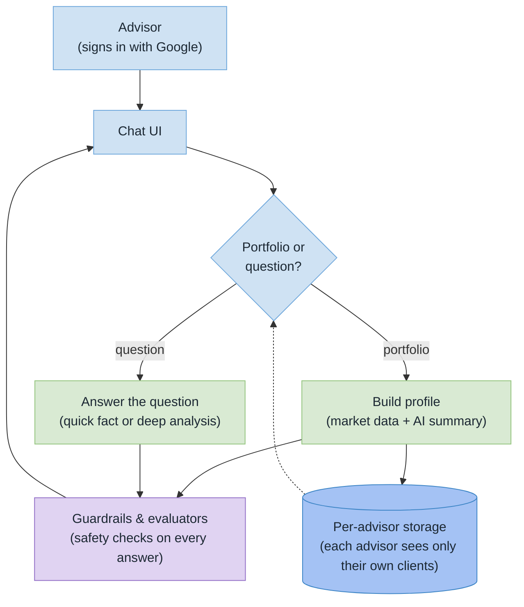
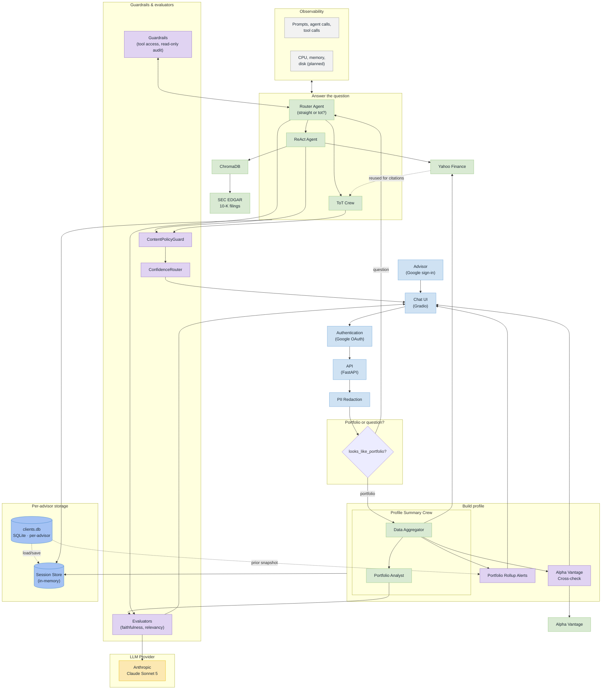

# Market Forecaster — System Architecture

## High-level overview

The short version, for walking through the system before diving into the
detailed diagram below: an advisor signs in with Google, talks to a chat
UI, and either submits a portfolio (built into a profile using live
market data) or asks a question (answered via a quick lookup or a deeper
multi-agent analysis, depending on what the question needs). Every answer
passes through guardrails and evaluators before reaching the advisor, and
each advisor's data is stored separately from every other advisor's.

Every box above expands into several real components in the detailed
diagram below — e.g. "Build profile" is actually the Data Aggregator and
Portfolio Analyst crew plus the rollup-alert and cross-source checks, and
"Guardrails & evaluators" covers five separate, independently-testable
components. Use this one to explain the shape of the system; use the one
below to point at a specific piece of it.

## Detailed architecture

Same 5 boxes as the high-level overview — **Portfolio or question?**,
**Build profile**, **Answer the question**, **Guardrails & evaluators**,
**Per-advisor storage** — drawn here as labeled boundary boxes so each one
visibly expands into its real components, in the same order and hierarchy
as above. Nothing here changes which box something belongs to; it only
adds the detail inside it.

**Fixed while restructuring**: the previous version wired Alpha Vantage as
a ReAct Agent tool (`REACT --> AV_MCP`). That never matched the code —
`data/alpha_vantage.py` is only ever called from the portfolio-submission
path (`orchestrator.py`'s `_check_cross_source`), not from any ReAct tool.
It's now drawn from the Alpha Vantage Cross-check node inside **Build
profile**, where it actually runs.

## Component Reference

Grouped by the same 5 boxes as both diagrams above.

### Advisor & entry (leads into "Portfolio or question?")
| Component | Role |
|---|---|
| **Advisor** | Signs in with Google — no session exists before this |
| **Chat UI (Gradio)** | Advisor-facing chat entry point — portfolio pasted in, questions asked here |
| **Authentication** | Google OAuth — verifies the advisor's identity before any session starts |
| **API (FastAPI)** | Single entry point into the backend, sitting between the UI and everything else |
| **PII Redaction** | Strips personally identifiable information from requests before they reach any agent |

### Portfolio or question?
| Component | Role |
|---|---|
| **`looks_like_portfolio?`** | A cheap heuristic check (no LLM call) — decides whether this message is a portfolio submission or a follow-up question, before anything else runs |

### Build profile
| Component | Role |
|---|---|
| **Profile Summary Crew** | Two CrewAI agents in sequence, run when `looks_like_portfolio` says yes |
| **Data Aggregator** | Fetches raw market data for every ticker via Yahoo Finance, hands the raw JSON to the Portfolio Analyst |
| **Portfolio Analyst** | Turns the raw data into the plain-English profile summary shown to the advisor — checked by the faithfulness evaluator before it's shown |
| **Portfolio Rollup Alerts** | `alerts.py` — diffs the newly fetched data against that same client's *previous* snapshot (read from clients.db) for rating changes and 5%+/10%+ price moves; silent if there's no prior snapshot or nothing changed, never fabricates a change |
| **Alpha Vantage Cross-check** | `alpha_vantage.py` — checks Yahoo's earnings/news for each ticker against Alpha Vantage, a fully independent second source; optional and never blocking (see "Cross-source validation" above) |

### Answer the question
| Component | Role |
|---|---|
| **Router Agent** | Classifies the question as `straight` or `tot` and routes it; the only agent that talks to Guardrails and Evaluators directly |
| **ReAct Agent** | Handles straight/factual questions — fetch, then answer. The only agent with live tool access (Yahoo Finance, ChromaDB) |
| **ToT Crew** | Handles complex/explanatory questions — 3 analyst lenses generate candidate reasoning, a critic scores them, a synthesizer produces the final answer. No tool calls of its own — cites news/earnings already fetched for the profile summary (dashed edge from Yahoo Finance) rather than making a fresh retrieval call |

### Guardrails & evaluators
| Component | Role |
|---|---|
| **Guardrails** | `guardrails.py` — `DataAccessGuard` (tool allow-lists per agent, checked at construction) and `ActionConstraintGuard` (a startup audit that refuses to launch if any agent has a write-capable tool) |
| **Evaluators** | `evaluators.py` — `FaithfulnessEvaluator` on the profile summary, `RelevancyEvaluator` on every ReAct/ToT answer, plus offline `AgentTaskEvaluator`/`CalibrationEvaluator` (not on the live request path) |
| **ContentPolicyGuard** | Flags advice-like phrasing ("you should buy...") in every ReAct/ToT answer and prepends a disclaimer rather than blocking it |
| **ConfidenceRouter** | Reads the ToT Critic's own self-rated confidence score and flags the answer as low-confidence in the UI when it's weak; ReAct answers skip this (no critic score exists for that path) |

### Per-advisor storage
| Component | Role |
|---|---|
| **Session Store** | In-memory `clients_state` — holds the active portfolio, profile summary, and ToT branch state for the current browser session; the agent group reads/writes it directly |
| **clients.db** | SQLite, partitioned by `advisor_id` (composite `(advisor_id, id)` primary key) — the durable long-term memory behind Session Store. Survives app restarts and browser sessions; each advisor's Google sign-in only ever loads their own rows, never another advisor's |

### External data sources (shared by Build profile / Answer the question)
| Component | Role |
|---|---|
| **Yahoo Finance** | Live data for every ticker — price, dividends, valuation, analyst rating, news, earnings, 3-month price history. The single primary source everything else is built or checked against |
| **Alpha Vantage** | Secondary source, cross-checked against Yahoo only (see Build profile above) — never a primary source, never called by the ReAct Agent |
| **ChromaDB** | Semantic search, ReAct-only → **search_filings** (10-K chunks, backed by SEC EDGAR) and **search_client_history** (this client's past turns) |
| **SEC EDGAR** | Fetches a ticker's latest 10-K on first request; chunked and embedded into ChromaDB, reused by every later query for that ticker (any client, any session) |
| **Anthropic (Claude Sonnet 5)** | The only LLM provider — used by every agent, on both the LangChain and CrewAI sides |

### Observability (cross-cutting, wraps "Answer the question")
| Component | Role |
|---|---|
| **Prompts, agent calls, tool calls** | LangSmith tracing — covers the LangChain half only (Router, ReAct); CrewAI's crews call `litellm` directly and aren't traced |
| **CPU, memory, disk** | Not yet built |
