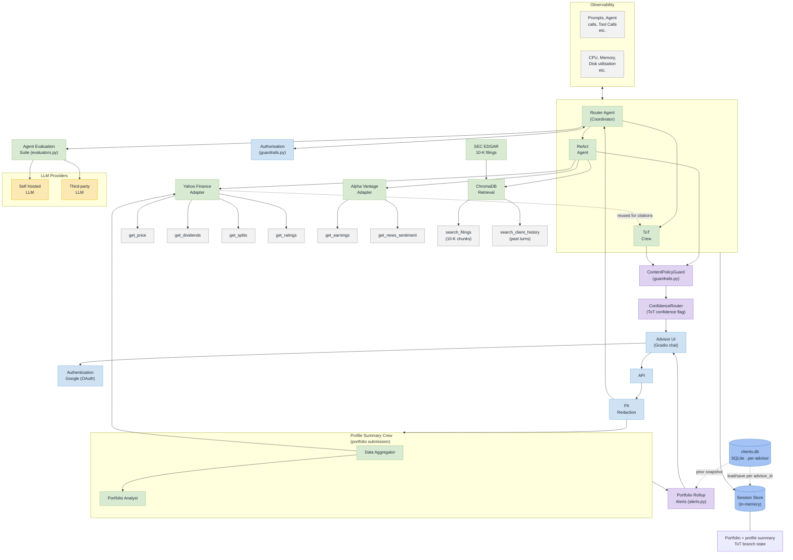

# Market Forecaster — System Architecture

Aligned to the reference banking multi-agent pattern (coordinator/sub-agent, per-domain tool servers, observability, evaluation, session store), with Google added as the identity provider.

## Component Reference

### Entry & Security
| Component | Role |
|---|---|
| **Advisor UI (Gradio chat)** | Advisor-facing chat entry point — portfolio pasted in, questions asked here |
| **Authentication** | Google (OAuth) — verifies the advisor's identity before any session starts |
| **API** | Single entry point into the backend, sitting between the UI and the agent layer |
| **PII Redaction** | Strips personally identifiable information from requests before they reach any agent |
| **Authorisation** | Checked by the Router Agent before dispatching to any sub-agent — enforced by `guardrails.py`'s tool allow-lists and startup action-constraint audit |

### Portfolio Submission Path
| Component | Role |
|---|---|
| **Profile Summary Crew** | Runs instead of the question-routing path when the advisor pastes a portfolio (`looks_like_portfolio`) — two CrewAI agents in sequence |
| **Data Aggregator** | Fetches raw market data for every ticker via the Yahoo Finance Adapter, hands the raw JSON to the Portfolio Analyst |
| **Portfolio Analyst** | Turns the raw data into the plain-English profile summary shown to the advisor |
| **Portfolio Rollup Alerts** | `alerts.py` — diffs the newly fetched data against that same client's *previous* snapshot (read from clients.db) for rating changes and 5%+/10%+ price moves; silent if there's no prior snapshot or nothing changed, never fabricates a change |

### Agent Layer
| Component | Role |
|---|---|
| **Router Agent (Coordinator)** | Classifies each advisor follow-up question and routes it to the correct path; the only agent that talks to Authorisation and Agent Evaluation Suite directly |
| **ReAct Agent** | Handles straight/factual questions — fetch, then answer. The only agent with live tool access (Yahoo Finance, Alpha Vantage, ChromaDB) |
| **ToT Crew** | Handles complex/explanatory questions — 3 analyst lenses generate candidate reasoning, a critic scores them, a synthesizer produces the final answer. No tool calls of its own — cites news/earnings already fetched for the profile summary (dashed edge from Yahoo Finance Adapter) rather than making a fresh retrieval call |

### LLM & Evaluation
| Component | Role |
|---|---|
| **Agent Evaluation Suite** | `evaluators.py` — faithfulness, relevancy, and agent-task correctness checks; sits between the Router Agent and the LLM providers |
| **Self Hosted LLM** | In-house model option — not yet wired in |
| **Third-party LLM** | External model provider — the model currently in use |
| **ContentPolicyGuard** | `guardrails.py` — flags advice-like phrasing ("you should buy...") in every ReAct/ToT answer and prepends a disclaimer rather than blocking it |
| **ConfidenceRouter** | `guardrails.py` — reads the ToT Critic's own self-rated confidence score and flags the answer as low-confidence in the UI when it's weak; ReAct answers skip this (no critic score exists for that path) |

### Tooling Layer (per source)
| Component | Role |
|---|---|
| **Yahoo Finance Adapter** | Exposes live data tools to the ReAct Agent (and the Data Aggregator) → **get_price**, **get_dividends**, **get_splits**, **get_ratings** |
| **Alpha Vantage Adapter** | Exposes secondary-source tools to the ReAct Agent → **get_earnings**, **get_news_sentiment** |
| **ChromaDB Retrieval** | Exposes semantic search to the ReAct Agent only → **search_filings** (10-K chunks, backed by SEC EDGAR) and **search_client_history** (this client's past turns) |
| **SEC EDGAR** | Fetches a ticker's latest 10-K on first request; chunked and embedded into ChromaDB, reused by every later query for that ticker (any client, any session) |

### Cross-Cutting
| Component | Role |
|---|---|
| **Observability** | Two feeds: (1) prompts, agent calls, tool calls — LangSmith tracing; (2) CPU, memory, disk utilisation — not yet built. Wraps the whole agent layer. |
| **Session Store** | In-memory `clients_state` — holds the active portfolio, profile summary, and ToT branch state for the current browser session; the agent group reads/writes it directly |
| **clients.db** | SQLite, partitioned by `advisor_id` (composite `(advisor_id, id)` primary key) — the durable long-term memory behind Session Store. Survives app restarts and browser sessions; each advisor's Google sign-in only ever loads their own rows, never another advisor's |
